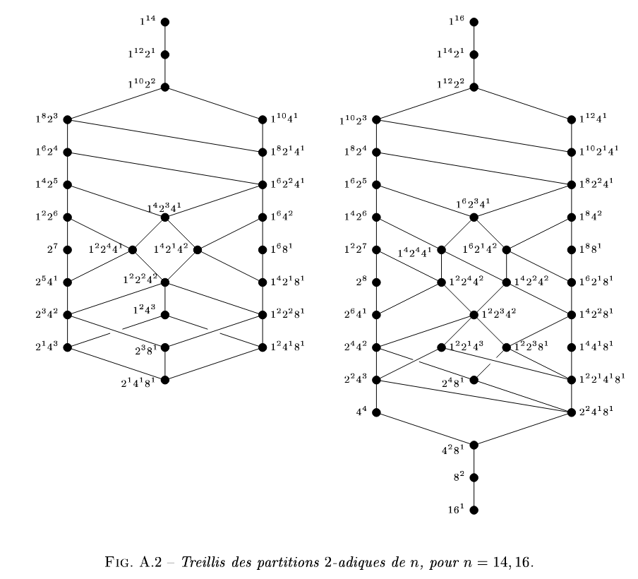

# Partition

Soit $n$ un entier naturel. Une partition de $n$ est une suite décroissante d'entiers positifs ou nuls $\underline \lambda = (\lambda_i)_{n \geq 0}$ telle que $\sum_{n \geq 0} \lambda_i = n$.

> **Proposition.**  
> Les entiers $\lambda_i$ sont nuls à partir d’un certain rang.

> **Définition.**  
> On appelle longueur de $\underline \lambda$ le plus grand entier $l$ tel que $\lambda_l$ est non nul.

> **Définition.**  
> On appelle partition $p$-adique de l'entier $n$ une partition de $n$ où tout les $\lambda_i$ sont des puissances de $p$ (Comprenant également 1)

> **Théorème.**  
> Soit $n$ un entier naturel, alors les partitions $p$-adiques de $n$ forment un treillis pour l'ordre du raffinement
> 
> Source: [Annexe A Thèse Troesch](http://alain.troesch.free.fr/These/troesch_these.pdf)

> **Exemple.**  
> 

